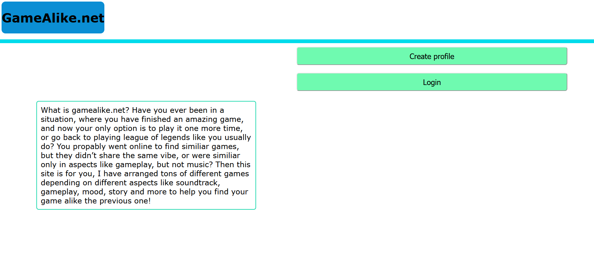
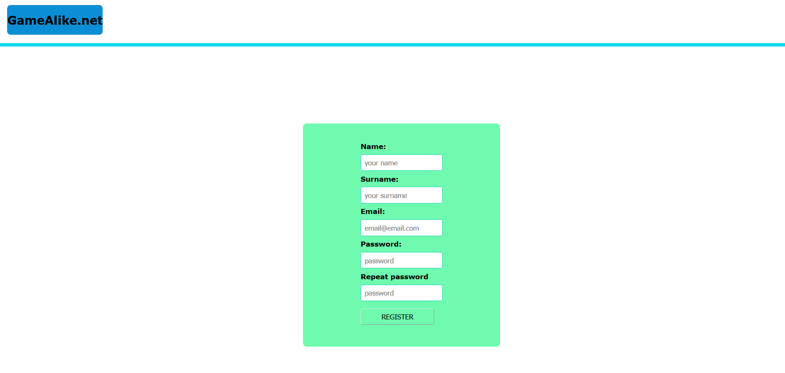
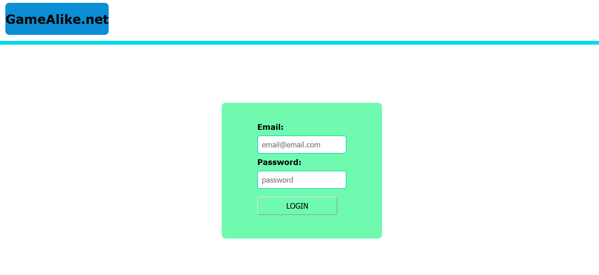
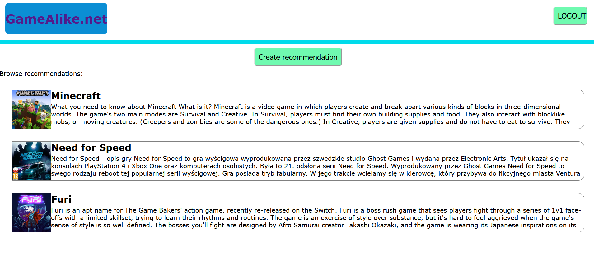
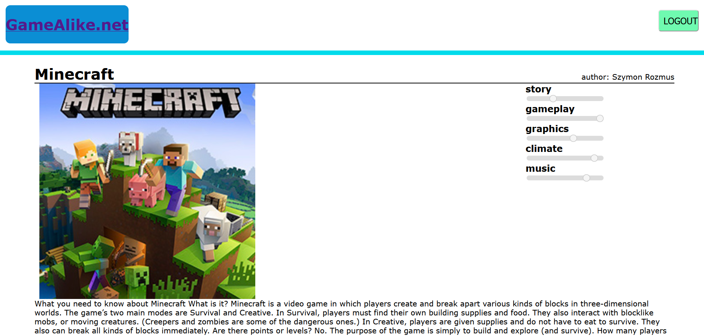
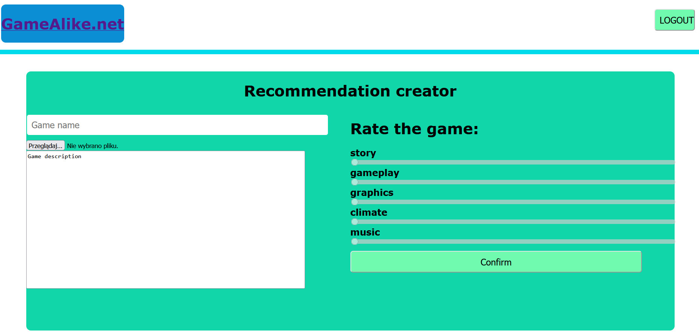

# General information
This project was created as assignment for university during introduction
to internet applications design course. big portion of codebase is developed
based on professor Adrian Widłak video tutorials https://www.youtube.com/watch?v=3uxilPhD0HU

# Project Description
The website allows users to assemble reviews/recommendations about video games, and
add comprehensible rating in form of 5 values ranging from gameplay to music.
login system is implemented and integrated with PostgreSQL database. Project was tested
on Firefox and Microsoft Edge browsers.

# Technologies used
- HTML 5
- CSS3
- PostgreSQL
- PHP
- JS
- Docker

# Screenshots

